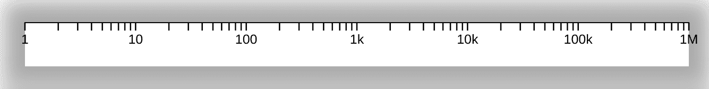

[](https://www.npmjs.com/package/react-d3-axis-ts)
[](https://www.npmjs.com/package/react-d3-axis-ts)

# react-d3-axis-ts



The d3 axis, with some improvements.
- The style is configurable.
- The path and lines are now centered on the axis and scale values and use `shape-rendering: crispEdges`.

## Usage

```tsx
import { Axis } from 'react-d3-axis-ts';

<Axis
  orient='left'
  scale={yScale}
  tickArguments={[10]}
  color='#f99'
  tickSizeInner={width - 40}
  tickSizeOuter={width - 40}
  scaleRev={rev}
/>
```
